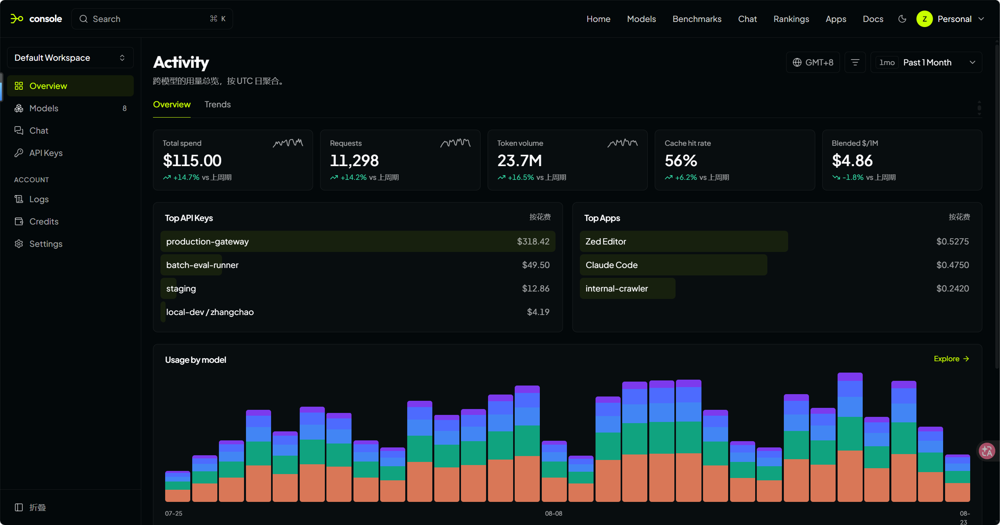
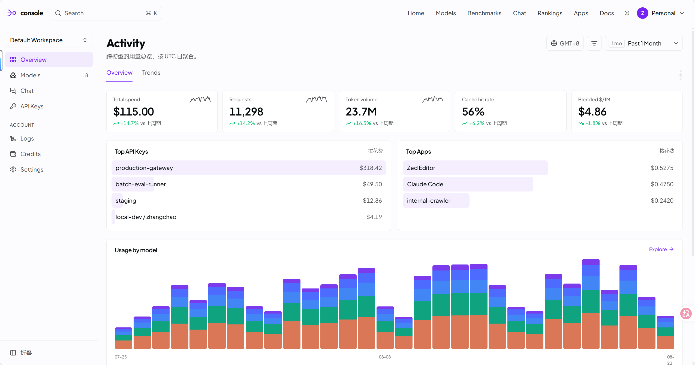
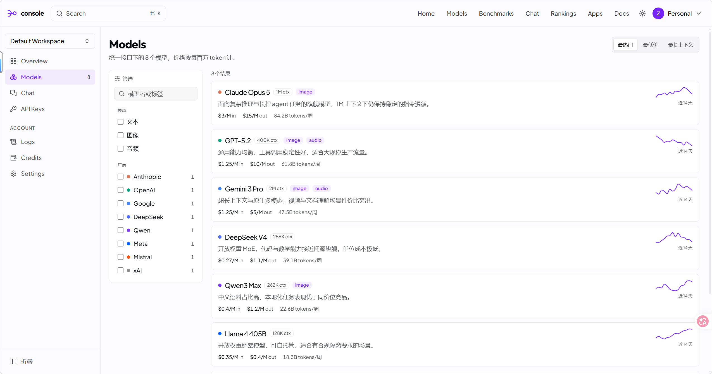
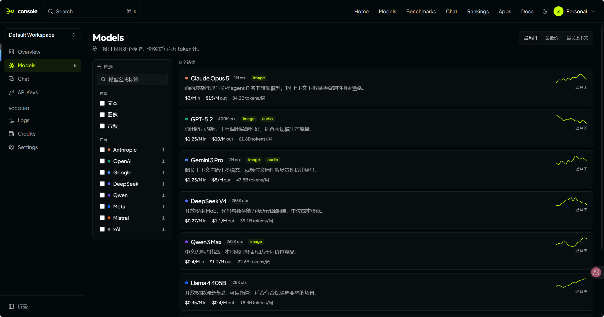
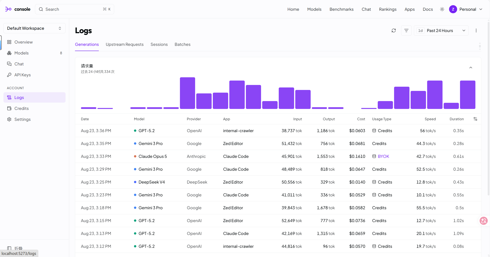
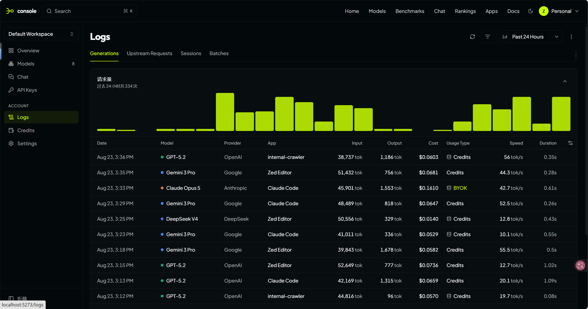

# CloseRouterUI

一套值得偷走的 Vue 3 控制台设计令牌系统。亮色是紫，暗色是柠檬绿 —— 而组件代码里
**一个 `dark:` 变体都没有**。

[](https://github.com/yak33/CloseRouterUI/actions/workflows/ci.yml)
[](LICENSE)
[](https://vuejs.org/)
[](https://tailwindcss.com/)

**[在线预览](https://closerouter-ui.vercel.app)** · [English](README.md)



> **与 OpenRouter 官方无任何关联。** 这是一个独立开源项目，视觉语言参考自
> [OpenRouter](https://openrouter.ai/)：设计令牌的数值取自其生产环境样式表 ——
> 色值是事实数据，不构成创作 —— 但本项目的代码、组件与品牌标识均为原创。

---

## 为什么做这个

大多数 Vue 后台模板给你的是一个组件库加一个取色器。这个项目给的是**令牌系统** ——
让界面显得「被设计过」而不是「被拼装出来」的那一层。

三个结构性设计承担了绝大部分工作：

### 1. `accent` 由 `primary` 推导，明暗差异零成本

```css
--accent:            hsl(<primary> / 0.078);   /* 选中底色 */
--accent-foreground: hsl(<primary>);           /* 选中文字色 */
--accent-subtle:     hsl(<primary> / 0.031);   /* 悬浮底色 */
```

菜单选中态就是 `bg-accent text-accent-foreground`。紫与柠檬绿的差异由令牌层自己吸收，
所以**组件代码里没有任何 `dark:` 变体**。

### 2. `border` 和 `muted` 是「前景色带低透明度」

```css
--border:           hsl(<foreground> / 0.078);
--muted-foreground: hsl(<foreground> / 0.69);
```

不是独立的灰阶。分隔线天然带着当前主题的色温 —— 这就是为什么切换主题后不会有任何
元素显得「差一点意思」。

### 3. 两种主题下，卡片都比页面更亮

| | 强调色 | 页面底 | 卡片 |
|---|---|---|---|
| 亮色 | `#7624F4` | `#FCFCFE` | `#FFFFFF` |
| 暗色 | `#C8FF00` | `hsl(197 54% 2.5%)` | `hsl(197 30% 4.5%)` |

表面不靠一行 box-shadow 就能浮起来。

---

## 技术栈

| 层 | 选型 | 说明 |
|---|---|---|
| 框架 | Vue 3.5 + Vite 8 + TypeScript 6 | `<script setup>` + Composition API |
| 样式 | Tailwind CSS v4 | `@theme inline`，无 `tailwind.config.js` |
| 组件原语 | [Reka UI](https://reka-ui.com/) | 无头库 —— **零 CSS**，只提供行为与无障碍 |
| 图标 | `@lucide/vue` | 不是已废弃的 `lucide-vue-next` |
| 字体 | Fontsource（自托管） | Outfit · Plus Jakarta Sans · Geist Mono |
| 图表 | 手写 SVG | 不引图表库，颜色直接读 CSS 令牌 |

**Reka UI 和 Element Plus / Ant Design Vue 不是一类东西。** 它提供键盘导航、焦点管理和
ARIA 语义，完全不提供外观。这正是令牌层能干净生效的原因 —— 没有任何东西需要覆盖。

---

## 快速开始

```bash
pnpm install
pnpm dev        # http://localhost:5173
pnpm build      # vue-tsc 类型检查 + 生产构建
```

需要 Node ≥ 20.19（见 `.nvmrc`）。

---

## 截图

| 亮色 | 暗色 |
|---|---|
|  |  |
|  |  |
|  |  |

---

## 页面

| 路由 | 演示了什么 |
|---|---|
| `/activity` | 5 张指标卡、Top-N 排行、堆叠用量图、可用的指标页签 |
| `/models` | 高密度目录，筛选（搜索 / 模态 / 厂商）与三种排序均可实际操作 |
| `/logs` | 可折叠直方图 + 11 列密集表格 |
| `/keys` | 额度进度条、掩码密钥、悬浮才出现的操作按钮 |
| `/credits` | 余额、充值预设、账单流水 |
| `/settings` | 表单分组与危险操作区 |
| `/chat` | 对话输入空状态 |

---

## 目录结构

```
src/
├── assets/styles/index.css   # ← 换皮只需要动这一个文件
├── components/
│   ├── ui/                   # shadcn-vue 目录约定：button/ badge/ card/ tabs/
│   ├── layout/               # AppShell · AppTopNav · AppSidebar · ThemeToggle
│   ├── charts/               # UsageChart · StackedBars · BarSeries · Sparkline
│   └── console/              # PageHeader · StatCard · RankList
├── composables/useTheme.ts   # light | dark | system 三态，互不塌缩
├── lib/{utils,format,curve}.ts
├── data/mock.ts              # 接真实 API 时替换此文件
├── views/
└── router/index.ts
```

### 换成自己的品牌

改 `src/assets/styles/index.css` 里 `:root` 和 `.dark` 的 `--primary`，然后让
`--accent` / `--accent-subtle` / `--secondary` / `--ring` 跟到同一色相、保持相同透明度。
其它文件一律不用动。

---

## 项目状态 —— 采用前请读

**作为样式底座是完整的。** 六个页面都有真实内容，明暗双主题，类型检查零错误，构建通过。

**不是可上线的产品。** 已知缺口：

- **26 个按钮里 18 个只有样式没有行为**（刷新、筛选、复制、保存、账户菜单等）
- 无数据层 —— `data/mock.ts` 是同步常量，没有 fetch / 重试
- 无状态管理（未装 Pinia）、无认证、无路由守卫
- 无 ESLint / Prettier / Vitest
- 加载态与错误态基本缺失
- 中英文硬编码混排，无 i18n
- 响应式断点写了但未在真机验证

建议的补齐顺序：**接按钮行为 → 抽数据层 → 补 loading/error 态 → 加 lint 与测试。**

---

## 文档

| 文档 | 面向 |
|---|---|
| [AGENTS.md](AGENTS.md) | AI 与新贡献者 —— 不可违反的约定、架构、如何扩展 |
| [docs/INTEGRATION.md](docs/INTEGRATION.md) | 融入既有 Vue 项目的三条路径 |

`AGENTS.md` 里记录了五条**违反后会静默失效**（不报错，效果直接没了）的约定，
动手改之前值得先看一眼。

---

## 许可证

[MIT](LICENSE) © ZHANGCHAO
